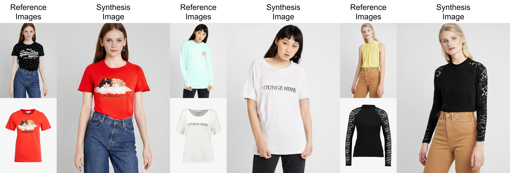

# HR-VITON &mdash; Official PyTorch Implementation
<!-- This repository contains a PyTorch implementation for our paper "High-Resolution Virtual Try-On with Misalignment and Occlusion-Handled Conditions". -->



> **High-Resolution Virtual Try-On with Misalignment and Occlusion-Handled Conditions**<br>
> [Sangyun Lee](https://github.com/sangyun884)\*<sup>1</sup>, [Gyojung Gu](https://github.com/koo616)\*<sup>2,3</sup>, [Sunghyun Park](https://psh01087.github.io)<sup>2</sup>, [Seunghwan Choi](https://github.com/shadow2496)<sup>2</sup>, [Jaegul Choo](https://sites.google.com/site/jaegulchoo)<sup>2</sup><br>
> <sup>1</sup>Soongsil University, <sup>2</sup>KAIST, <sup>3</sup>Nestyle<br>
> In ECCV 2022 (* indicates equal contribution)

> Paper: https://arxiv.org/abs/2206.14180<br>
> Project page: https://koo616.github.io/HR-VITON

> **Abstract:** *Image-based virtual try-on aims to synthesize an image of a person wearing a given clothing item. To solve the task, the existing methods warp the clothing item to fit the person's body and generate the segmentation map of the person wearing the item before fusing the item with the person. However, when the warping and the segmentation generation stages operate individually without information exchange, the misalignment between the warped clothes and the segmentation map occurs, which leads to the artifacts in the final image. The information disconnection also causes excessive warping near the clothing regions occluded by the body parts, so-called pixel-squeezing artifacts. To settle the issues, we propose a novel try-on condition generator as a unified module of the two stages (i.e., warping and segmentation generation stages). A newly proposed feature fusion block in the condition generator implements the information exchange, and the condition generator does not create any misalignment or pixel-squeezing artifacts. We also introduce discriminator rejection that filters out the incorrect segmentation map predictions and assures the performance of virtual try-on frameworks. Experiments on a high-resolution dataset demonstrate that our model successfully handles the misalignment and occlusion, and significantly outperforms the baselines.*

## Installation

Clone this repository:

```
git clone https://github.com/sangyun884/HR-VITON.git
cd ./HR-VITON/
```

Install PyTorch and other dependencies:

```
conda create -n {env_name} python=3.8
conda activate {env_name}
conda install pytorch torchvision torchaudio cudatoolkit=11.1 -c pytorch-lts -c nvidia
pip install opencv-python torchgeometry Pillow tqdm tensorboardX scikit-image scipy
```

## Dataset
We train and evaluate our model using the dataset from [VITON-HD: High-Resolution Virtual Try-On via Misalignment-Aware Normalization](https://github.com/shadow2496/VITON-HD).

To download the dataset, please check the following link https://github.com/shadow2496/VITON-HD.

We assume that you have downloaded it into `./data`.

## Inference

Here are the download links for each model checkpoint:

- Try-on condition generator: [link](https://drive.google.com/file/d/1XJTCdRBOPVgVTmqzhVGFAgMm2NLkw5uQ/view?usp=sharing)
- Try-on condition generator (discriminator): [link](https://drive.google.com/file/d/1Gi185XUAI3w4srReTbp3eIzkjFC51ym-/view?usp=sharing)
- Try-on image generator: [link](https://drive.google.com/file/d/1BkSA8UJo-6eOkKcXTFOHK80Esc4vBmVC/view?usp=sharing)
- AlexNet (LPIPS): [link](https://drive.google.com/file/d/1FF3BBSDIA3uavmAiuMH6YFCv09Lt8jUr/view?usp=sharing), we assume that you have downloaded it into `./eval_models/weights/v0.1`.

```python
python3 test_generator.py --occlusion --cuda {True} --test_name {test_name} --tocg_checkpoint {condition generator ckpt} --gpu_ids {gpu_ids} --gen_checkpoint {image generator ckpt} --datasetting unpaired --dataroot {dataset_path} --data_list {pair_list_textfile}
```

## Train try-on condition generator

```python
python3 train_condition.py --cuda {True} --gpu_ids {gpu_ids} --Ddownx2 --Ddropout --lasttvonly --interflowloss --occlusion
```

## Train try-on image generator

```python
python3 train_generator.py --cuda {True} --name test -b 4 -j 8 --gpu_ids {gpu_ids} --fp16 --tocg_checkpoint {condition generator ckpt path} --occlusion
```
This stage takes approximately 4 days with two RTX 3090 GPUs. Tested environment: PyTorch 1.8.2+cu111.

To use "--fp16" option, you should install apex library.

## License

All material is made available under [Creative Commons BY-NC 4.0](https://creativecommons.org/licenses/by-nc/4.0/). You can **use, redistribute, and adapt** the material for **non-commercial purposes**, as long as you give appropriate credit by **citing our paper** and **indicate any changes** that you've made.

## Citation

If you find this work useful for your research, please cite our paper:

```
@article{lee2022hrviton,
  title={High-Resolution Virtual Try-On with Misalignment and Occlusion-Handled Conditions},
  author={Lee, Sangyun and Gu, Gyojung and Park, Sunghyun and Choi, Seunghwan and Choo, Jaegul},
  journal={arXiv preprint arXiv:2206.14180},
  year={2022}
}
```
